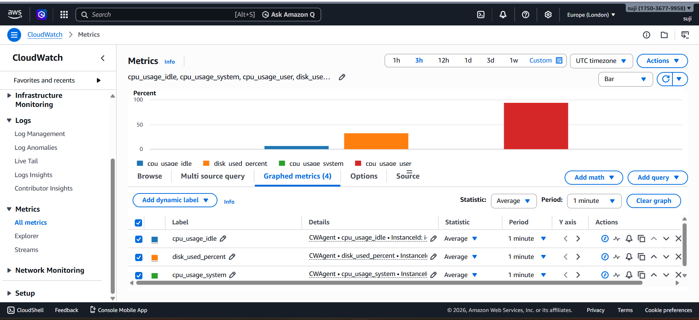
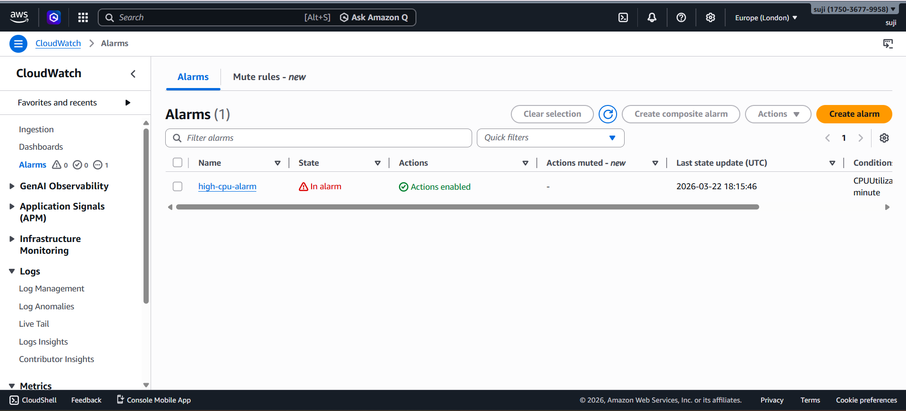
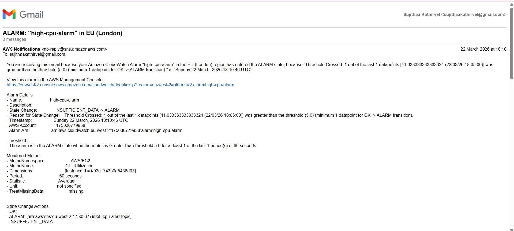
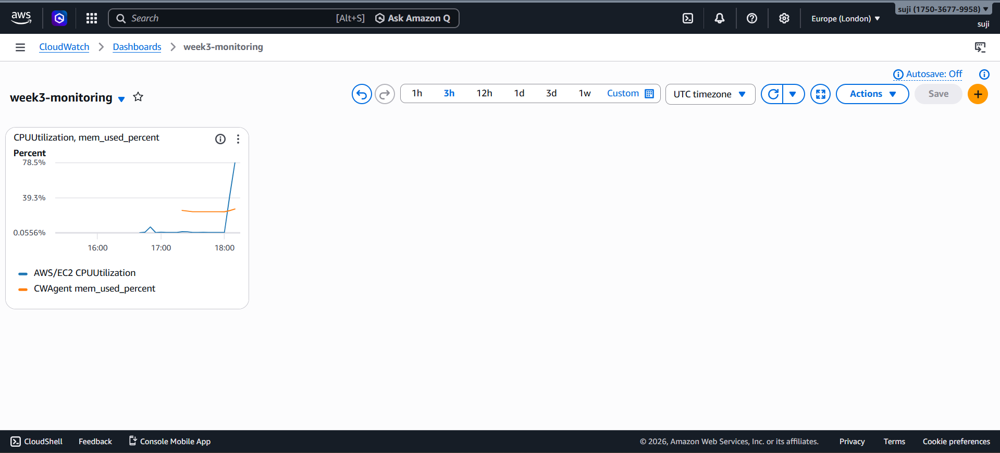
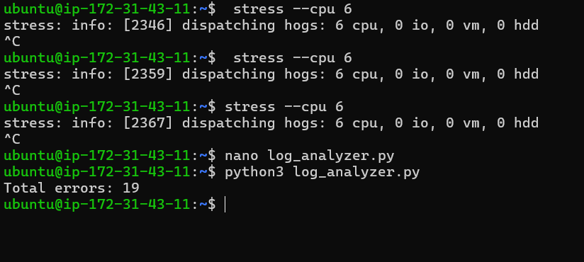

# Monitoring & Observability (CloudWatch + SNS)

## Overview

Implemented a monitoring and alerting system on AWS to track system performance and detect failures in real time.

The system collects metrics from EC2, triggers alarms based on thresholds, and sends notifications via SNS.

---

## Services Used

- Amazon EC2  
- Amazon CloudWatch  
- Amazon SNS  

---

## Implementation

- Installed and configured CloudWatch Agent on EC2  
- Collected system metrics (CPU, memory, disk)  
- Created CloudWatch alarm for CPU utilization  
- Configured SNS for email notifications  
- Built a CloudWatch dashboard for visualization  
- Simulated high CPU usage to validate alerting  

---

## Alert Flow

EC2 → CloudWatch → Alarm → SNS → Email

---

## Observability

- Metrics visualized through CloudWatch dashboards  
- Alerts triggered based on threshold breaches  
- Logs analyzed to identify system-level issues  

---

## Log Analysis (Python)

A Python script was developed to analyze system logs:

- Reads `/var/log/syslog`  
- Counts error occurrences  
- Outputs a summary report  

---

## Screenshots

### Metrics

### Alarm Triggered

### Email Alert

### Dashboard

### Log Analysis Output

---

## Key Learnings

- Difference between monitoring and observability  
- Designing alerting systems using CloudWatch and SNS  
- Importance of real-time system visibility  
- Using logs to support incident analysis  

---

## Outcome

Built a monitoring and alerting pipeline capable of detecting system issues and notifying users in real time.

---

## Future Improvements

- Add memory and disk-based alarms  
- Integrate logs into CloudWatch Logs  
- Automate infrastructure using Terraform  