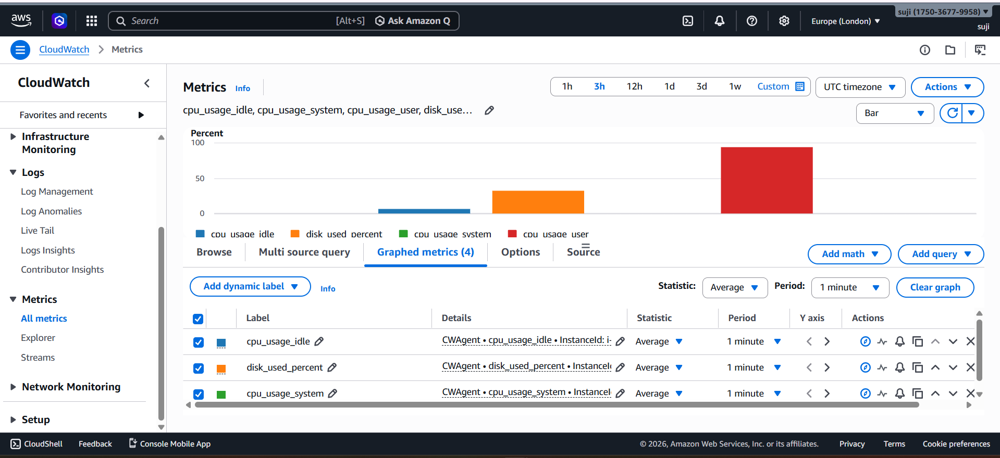
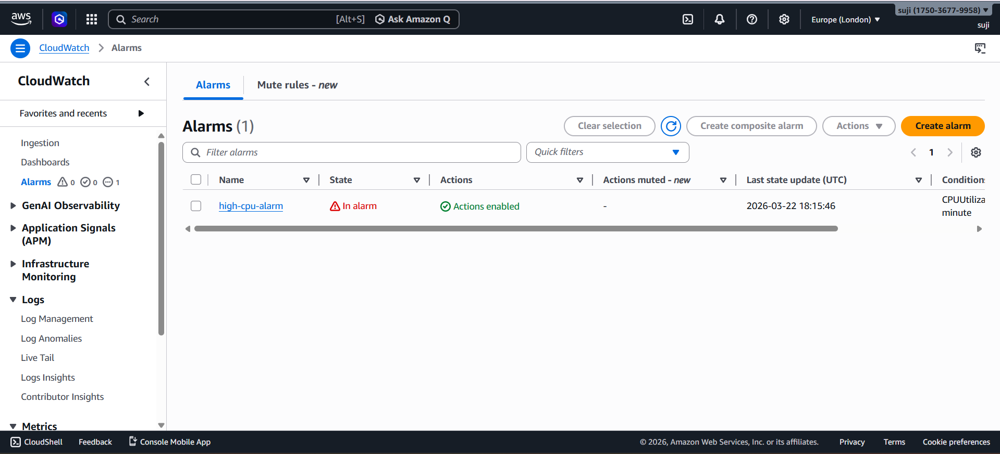
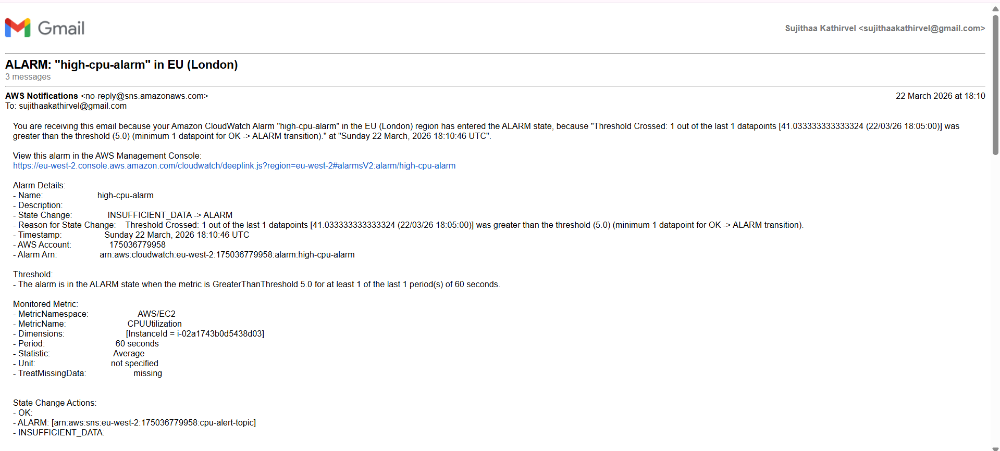
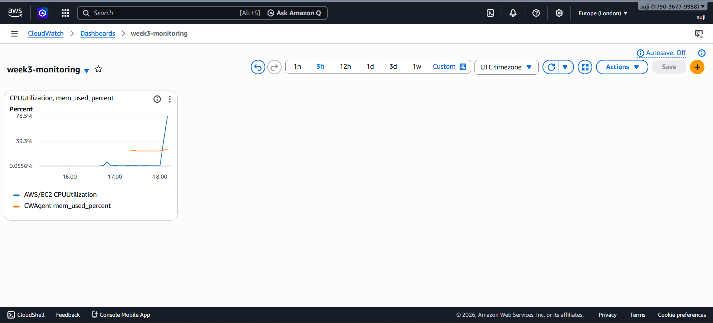
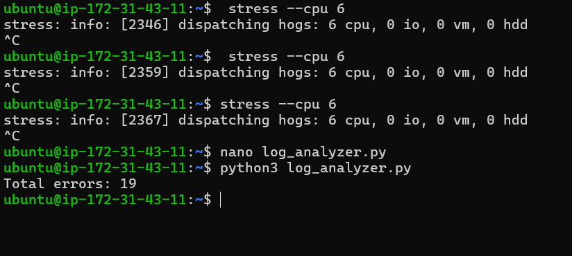

# Monitoring & Observability Pipeline on AWS

## Overview

Designed and implemented a **monitoring and alerting pipeline on AWS** to track system performance, detect abnormal behaviour, and support proactive incident response.

The system collects EC2 metrics using CloudWatch, evaluates thresholds through CloudWatch Alarms, and sends notifications via SNS.

---

## Services Used

- Amazon EC2
- Amazon CloudWatch
- Amazon SNS

---

## Architecture Flow

EC2 → CloudWatch Metrics → CloudWatch Alarm → SNS → Email Notification

---

## Architecture Decisions

- **Amazon CloudWatch** for native AWS monitoring and metric collection
- **Amazon SNS** for event-driven email notifications
- **CloudWatch Agent** for additional system-level metrics
- **Python log analysis** to complement metrics with application/system-level insights

---

## Implementation

- Installed and configured the CloudWatch Agent on EC2
- Collected CPU, memory, and disk metrics
- Created CloudWatch Alarms using CPU utilisation thresholds
- Configured SNS for email notifications
- Built CloudWatch dashboards for metric visualisation
- Simulated high CPU usage to validate the alerting workflow

---

## Observability Design

- Metrics collected through the CloudWatch Agent
- Dashboards provide visibility into CPU, memory, and disk usage
- Alarms detect threshold breaches automatically
- Logs support troubleshooting and root cause analysis
- Combined metrics and logs to improve system visibility

---

## Incident Response Workflow

1. CloudWatch detects a threshold breach
2. Alarm transitions to the `ALARM` state
3. SNS sends an email notification
4. Engineer investigates using metrics, logs, and system tools

---

## Log Analysis with Python

Developed a Python-based log analysis tool to support troubleshooting.

- Reads `/var/log/syslog`
- Identifies and counts error occurrences
- Produces a summarised output for quick analysis

---

## Security Considerations

- CloudWatch Agent configured using IAM roles rather than hardcoded credentials
- SNS notifications restricted to authorised subscribers

---

## Key Outcomes

- Built a monitoring and alerting pipeline on AWS
- Enabled automated detection of system anomalies
- Improved visibility through CloudWatch dashboards
- Combined infrastructure metrics with Python-based log analysis
- Practised a proactive incident detection and response workflow

---

## Screenshots

### Metrics

### Alarm Triggered

### Email Alert

### CloudWatch Dashboard

### Python Log Analysis

---

## Skills Demonstrated

- AWS monitoring and observability
- CloudWatch metrics, alarms, and dashboards
- SNS-based alerting
- Linux system monitoring
- Log analysis with Python
- Incident detection and troubleshooting

---

## Future Improvements

- Add memory and disk-based CloudWatch alarms
- Integrate application logs with CloudWatch Logs
- Automate infrastructure using Terraform
- Implement CloudWatch anomaly detection
