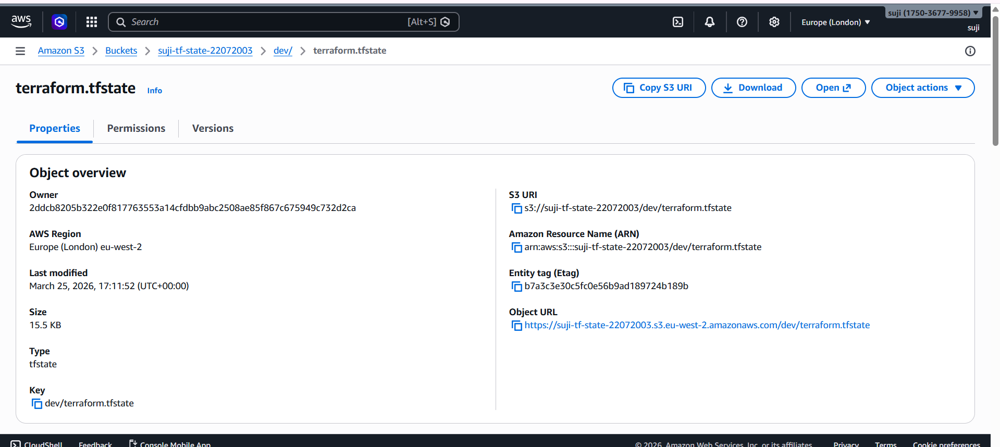
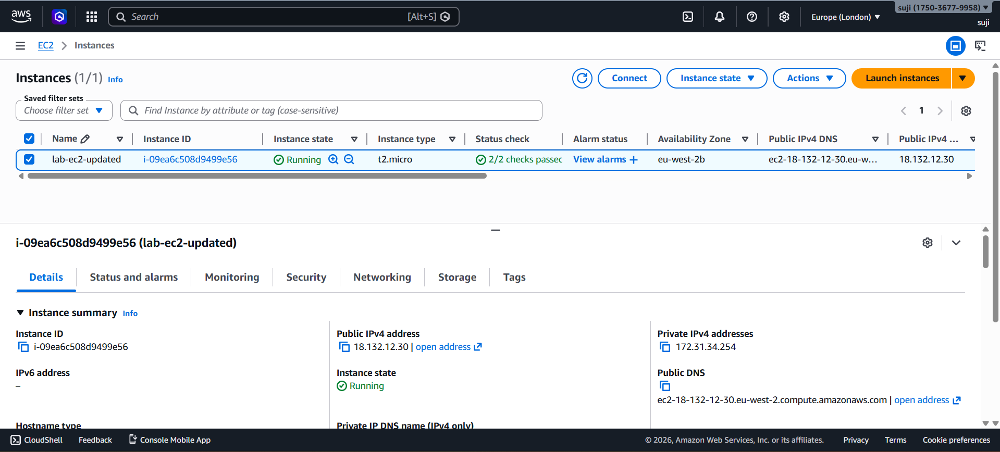
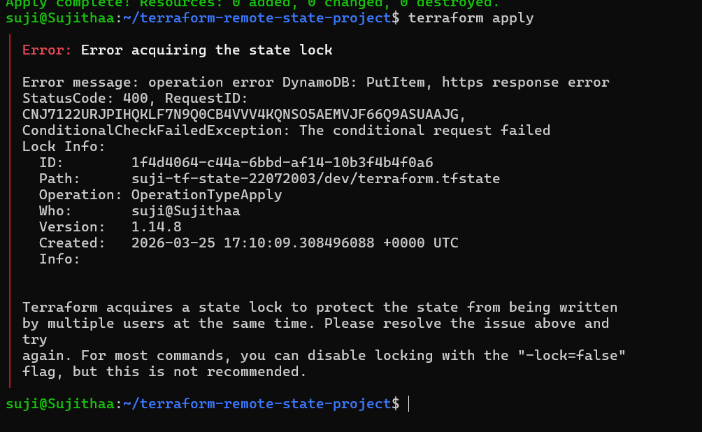

# Terraform Remote State (S3 + DynamoDB)

## Overview

Implemented Terraform remote state management using Amazon S3 for state storage and DynamoDB for state locking.

This setup simulates a production-style workflow where multiple engineers can safely collaborate on infrastructure.

---

## Architecture

- Terraform state stored in S3 (remote backend)  
- DynamoDB used for state locking  
- EC2 instance provisioned using Terraform  
- Security Group configured for controlled access  

---

## Tech Stack

- Terraform  
- Amazon S3  
- Amazon DynamoDB  
- Amazon EC2  

---

## Implementation

- Configured S3 bucket with versioning and encryption  
- Enabled remote backend in Terraform  
- Implemented state locking using DynamoDB  
- Provisioned EC2 instance and security group  
- Executed full lifecycle: `init → apply → destroy`  

---

## Project Structure

```
04-terraform-remote-state/
│
├── main.tf
├── provider.tf
├── backend.tf
├── variables.tf
├── outputs.tf
├── terraform.tfvars
├── .gitignore
└── screenshots/
```

---

## Workflow

1. Bootstrap S3 bucket and DynamoDB table  
2. Configure remote backend and migrate state  
3. Provision infrastructure using Terraform  
4. Validate state locking using concurrent operations  

---

## Screenshots

### S3 State File


### EC2 Running


### State Lock Error


---

## Security

- S3 bucket with versioning and encryption enabled  
- Public access blocked  
- DynamoDB locking prevents concurrent state modification  

---

## Key Learnings

- Remote state management in Terraform  
- Importance of state locking in team environments  
- Infrastructure lifecycle management  
- Debugging Terraform workflows  

---

## Outcome

Built a production-style Terraform workflow with secure remote state management and state locking for safe collaboration.