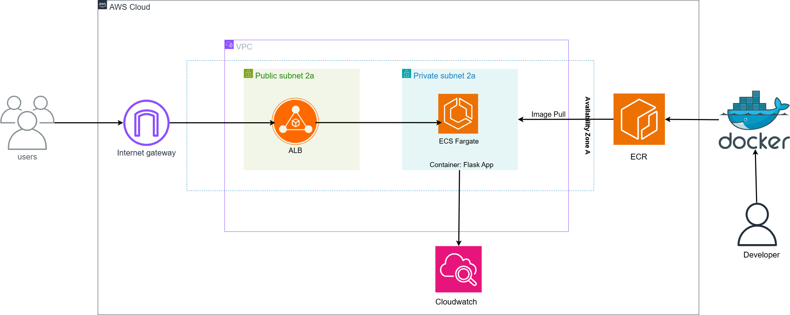
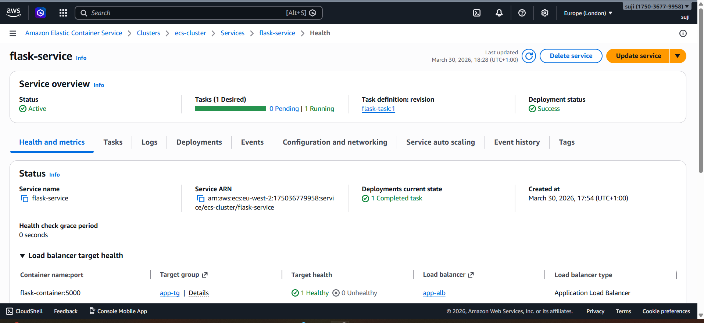
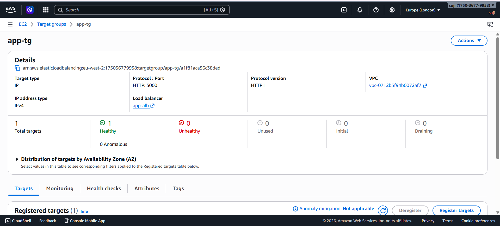
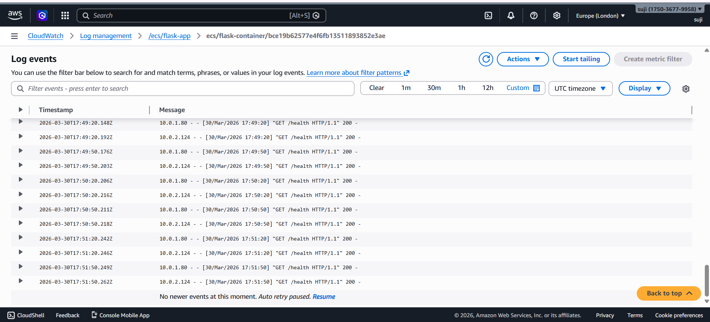
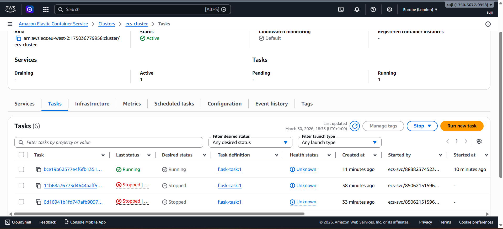

# AWS ECS Fargate Deployment (Terraform)

## Overview

This project demonstrates deploying a containerized Python (Flask) application on AWS using Terraform. It follows a production-style architecture with ECS Fargate, Application Load Balancer, private networking, and CloudWatch logging.

---

## Architecture




---

## Tech Stack

* AWS ECS Fargate
* Application Load Balancer (ALB)
* Amazon ECR
* CloudWatch Logs
* Terraform
* Docker
* Python (Flask)

---

## Project Structure

```
app/
terraform/
screenshots/
```

---

## Features

* Containerized application using Docker
* Infrastructure provisioned with Terraform
* Public ALB + private ECS setup
* Health checks (`/health`)
* CloudWatch logging
* Self-healing (task restart)

---

## Self-Healing

A running ECS task was manually stopped to simulate failure. ECS automatically launched a new task to maintain availability.

---

## Screenshots


### 🔹 ECS Service Running




### 🔹 Target Group Health




### 🔹 CloudWatch Logs




### 🔹 Self-Healing (Task Restart)




---

## Key Learnings

* Container lifecycle (build → push → deploy)
* ECS Fargate architecture
* Load balancing with ALB
* Logging with CloudWatch
* Infrastructure as Code using Terraform
* Designing resilient systems

---

## Conclusion

This project showcases a real-world cloud deployment using AWS and Terraform, focusing on scalability, security, and reliability.
