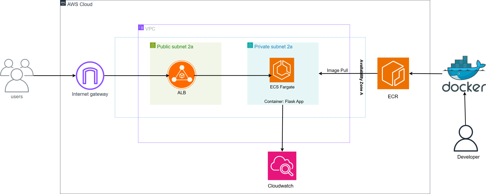
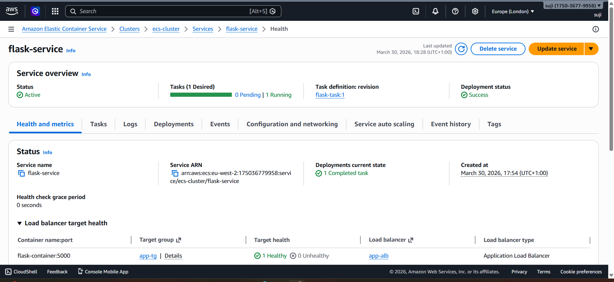
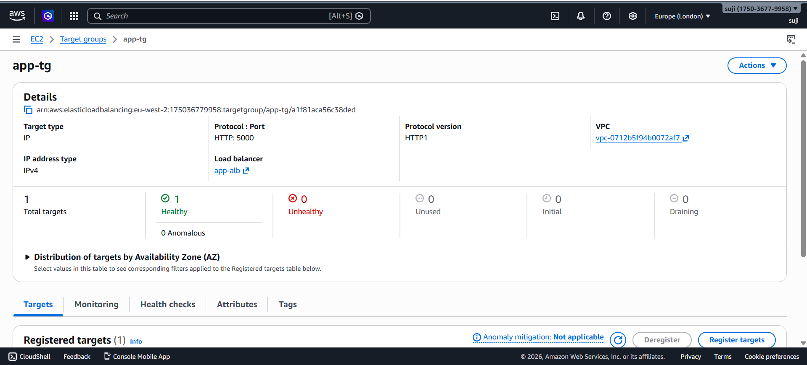
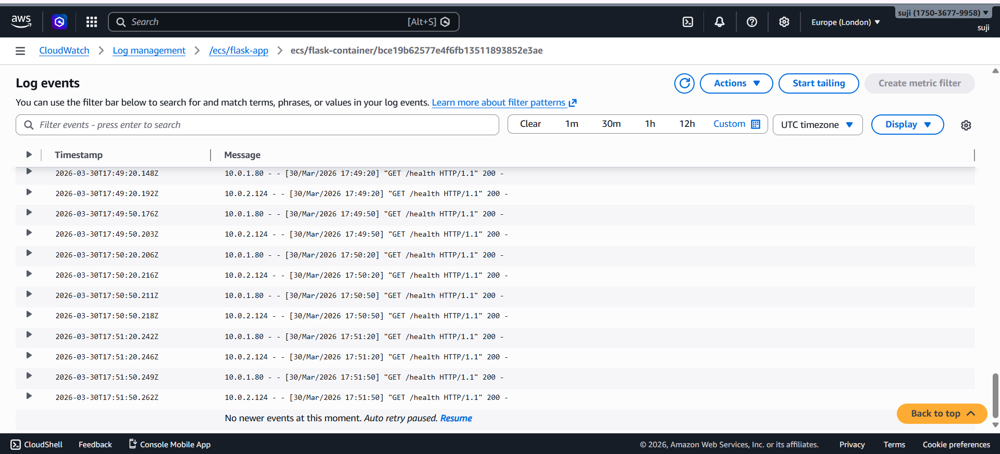
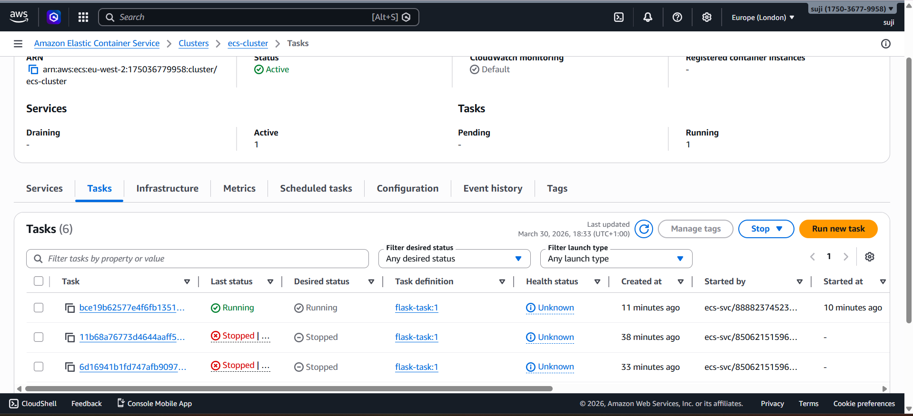

# Containerized Application on AWS (ECS Fargate + Terraform)

## Overview

Designed, deployed, and operated a containerized application on AWS using **ECS Fargate and Terraform**.

The architecture uses an **Application Load Balancer, private subnets, Amazon ECR, and CloudWatch Logs** to provide secure networking, load balancing, centralized logging, and automatic task recovery.

---

## Architecture



---

## Architecture Flow

```text
User
  ↓
Application Load Balancer (Public Subnet)
  ↓
ECS Fargate Tasks (Private Subnet)
  ↓
Flask Application
  ↓
CloudWatch Logs
```

---

## Tech Stack

- Amazon ECS Fargate
- Application Load Balancer (ALB)
- Amazon ECR
- Amazon CloudWatch Logs
- Terraform
- Docker
- Python (Flask)

---

## Architecture Decisions

- **Fargate over EC2** — removes the need to manage underlying servers.
- **Private subnets for ECS tasks** — prevents direct public access to containers.
- **Application Load Balancer** — distributes traffic and performs health checks.
- **CloudWatch Logs** — provides centralized container logging.
- **Amazon ECR** — stores and manages container images.

---

## Implementation

- Built and containerized a Python Flask application.
- Built and pushed the Docker image to Amazon ECR.
- Provisioned AWS infrastructure using Terraform.
- Configured an Application Load Balancer, target group, and listener.
- Deployed ECS Fargate tasks in private subnets.
- Configured CloudWatch logging for containers.
- Implemented a `/health` endpoint for ALB health checks.

---

## Self-Healing & Resilience

A running ECS task was manually stopped to simulate a container failure.

The ECS service automatically launched a replacement task, while the ALB health check ensured traffic was directed only to healthy tasks.

This demonstrates **automatic recovery and service availability**.

---

## Security Considerations

- Only the ALB exposes public HTTP traffic.
- ECS tasks run in private subnets.
- Security groups restrict traffic between the ALB and ECS tasks.
- IAM roles are used for ECS task execution.
- No credentials are hardcoded in the application.

---

## CI/CD Consideration

The architecture can be extended with a CI/CD pipeline to:

- Build Docker images automatically.
- Push images to Amazon ECR.
- Deploy updated images to ECS.
- Support rolling deployments with minimal downtime.

---

## Observability

- CloudWatch Logs provide centralized application logs.
- ECS and ALB metrics can be used for monitoring.
- CloudWatch Alarms and SNS can be added for proactive alerting.

---

## Trade-offs & Considerations

- Fargate reduces server management but can cost more than running containers on EC2.
- ALB adds infrastructure cost but provides load balancing and health checks.
- Stateless containers improve scalability but require external storage for persistent data.

---

## Project Structure

```text
05-ecs-fargate-deployment/
├── app/
├── terraform/
├── screenshots/
└── README.md
```

---

## Screenshots

### ECS Service Running



### Target Group Health



### CloudWatch Logs



### Self-Healing Task Restart



---

## Key Outcomes

- Deployed a containerized Flask application using ECS Fargate.
- Implemented secure networking with a public ALB and private ECS tasks.
- Demonstrated automatic task recovery.
- Configured centralized logging with CloudWatch.
- Automated infrastructure provisioning using Terraform.

---

## Skills Demonstrated

- Docker containerization
- ECS Fargate deployment
- Application Load Balancing
- Health checks
- Terraform Infrastructure as Code
- Amazon ECR
- CloudWatch Logs
- Fault-tolerant cloud architecture

---

## Future Improvements

- Implement a CI/CD pipeline for automated deployments.
- Add ECS auto-scaling based on CPU and memory.
- Add CloudWatch Alarms and SNS notifications.
- Configure HTTPS using AWS Certificate Manager (ACM).
